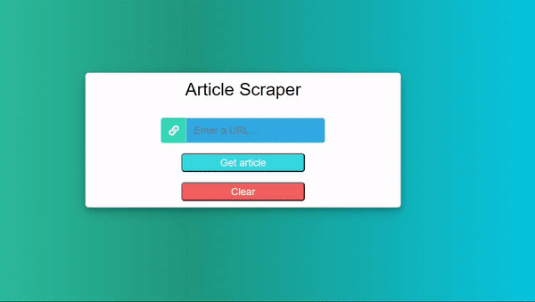

# WEC NITK GSDC Task ID: Web Scraper

This simple tool allows the user to provide a URL to article.  
The script scrapes the article contents and serves the article as a docx file to the user.

 

USP: It even works on websites that dont allow a user to read an article without a subscription/login!
One such article is <a href="https://www.nationalgeographic.com/animals/article/born-pink-blind-entirely-helpless-heres-how-giant-pandas-grow-up">here</a>

 

<h3> Demo </h3>

<h2>Setting up the project:</h2>
 
<h3>Installing and using a Virtual Environment</h3>

`pip install virtualenvwrapper-win` 
`mkvirtualenv test` &nbsp; _test = name of virtual env_

 

<h3>Install required packages:</h3>

`pip install -r requirements.txt` 

<h3>To run project:</h3>

_After ensuring that we are in a virtual environment (If not, use `workon test`)_

`python manage.py makemigrations`  
`python manage.py migrate`  
`python manage.py runserver` 

Visit development server http://127.0.0.1:8000/ 

 

 
<h2>Tech Stack</h2>
<code></code>
<code></code>
<code></code>
<code></code>
 
 

<h2>Implemented Features</h2>
<ul>
    <li>Scrape articles</li>
    <li>Ability to download a word doc of the same without storing it on server side</li>
</ul>

<h3>Known Bugs and imporvements</h3>
<ul>
    <li>Doesnt work on Medium articles </li>
    <li> Nothing to show the progress when file is being processed. </li>
</ul>

 
<h3>References:</h3>
<a href="https://docs.djangoproject.com/en/3.2/">Django's Official Documentation</a> 
<a href="https://python-docx.readthedocs.io/en/latest/user/documents.html">Python Docx Documentation</a> 
<a href="https://stackoverflow.com/">Stack Overflow</a> 
<a href="https://www.youtube.com/watch?v=s6Xi7x4G7yg">Running a python script from Django</a> 
<a href="https://blog.devgenius.io/export-docx-file-with-python-docx-in-django-app-527ff5eb7280">Exporting docx with Django</a> 
